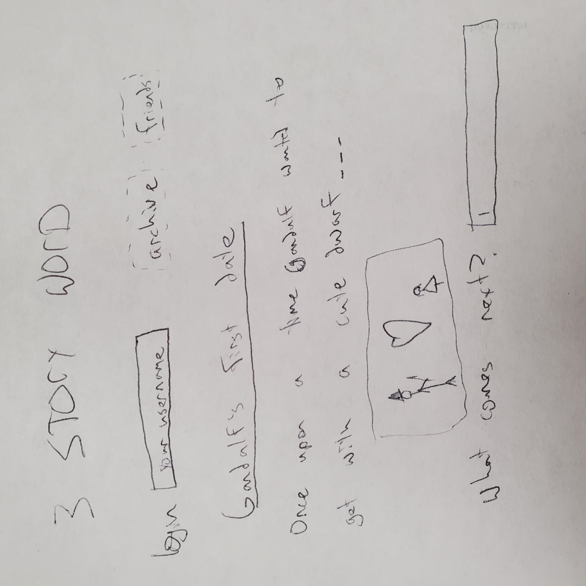
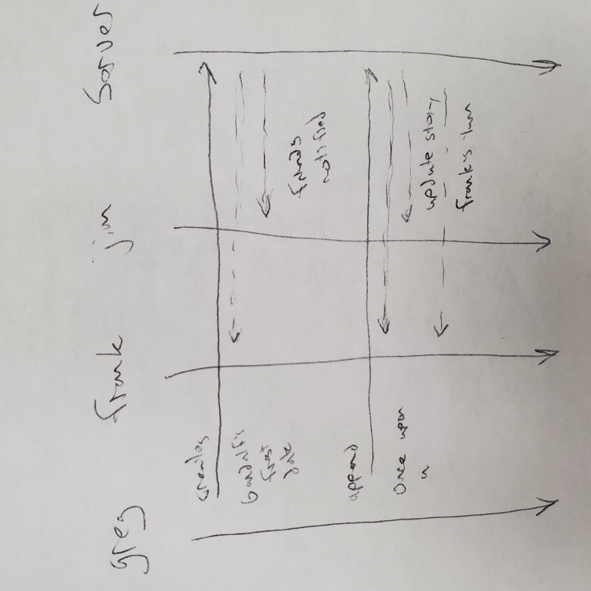

# [storyboard.ninja](https://storyboard.ninja/)

## Contents
- [Elevator Pitch](#elevator-pitch)
- [Design](#design)
- [Key Features](#key-features)
- [Technologies](#technologies)
- [Notes](https://github.com/radmuffin/startup/blob/main/notes.md)
- [HTML Deliverable](#html-deliverable)
- [CSS Deliverable](#css-deliverable)
- [JavaScript Deliverable](#javascript-deliverable)

## Elevator Pitch
You know that game where you're making a story with your friends, but you only get to add like three stories at a time? It never goes where you want, and something rediculous usually happens as far as the plot right? Well you're in luck because we have not fixed that problem! We're making it available to you and your friends all across the globe! Just hop on 3 Story Word, make an account, connect to your friends and with three words at a time spin fantastical stories together, alone! You're gonna love it :)) 

## Design

Here is a sequence diagram that shows how to people would interact with the backend to write a story.

## Key Features
- Secure login over HTTPS
- Connect with your friends
- Each friend gets a turn to add to the story
- Display of past stories
- See the current story as it's written in real time
- Ability for a user to save the story to read later
- Stories are persistently stored
- Generative ai illustrates the last sentence of the story

## Technologies
I am going to use the required technologies in the following ways.

- **HTML** - Uses correct HTML structure for application. Two HTML pages. One for login and one for voting. Hyperlinks to choice artifact.
- **CSS** - Application styling that looks good on different screen sizes, uses good whitespace, color choice and contrast.
- **JavaScript** - Provides login, choice display, applying votes, display other users votes, backend endpoint calls.
- **Service** - Backend service with endpoints for:
  - login
  - adding friends
  - retrieving stories
  - submitting your three words
  - retrieving updated story
- **DB/Login** - Store users, friends lists and stories in database. Register and login users. Credentials securely stored in database. Can't contribute unless authenticated and friends with the story creator
- **WebSocket** - As each user contributes, the story is updated for everyone
- **React** - Application ported to use the React web framework.

## HTML deliverable
For this deliverable I built out the structure of my application using HTML.

- **HTML pages** - Three HTML page that represent the ability to login, view created stories and write/contribute to a story.
- **Links** - The login page and archive page both link to the write page.
- **Text** - Each story contains the first line of it's contents in the archive, chicken big contains as much as was written in the write page.
- **Images** - There is an illustration for each story. I would like to implement this with generative ai, but may have to settle for random cat picures as I don't want to pay for an openAI subscription.
- **DB/Login** - Input box and submit button for login. The story choices represent data pulled from the database.
- **WebSocket** - The contributions of other users is transmitted to all active users, and the active story is updated. (Multiple stories can be edited depending on which each user chooses)

## CSS deliverable
For this deliverable I properly styled the application into its final appearance.

- **Header, footer, and main content body**
- **Navigation elements** - I used bootstrap to make the header look much prettier.
- **Responsive to window resizing** - My app looks great on all window sizes and devices
- **Application elements** - Used good contrast and whitespace - mostly
- **Application text content** - Consistent fonts
- **Application images** - Fullscreen background images and images in tiles.

## JavaScript deliverable

For this deliverable I implemented by JavaScript so that the application works for a single user. I also added placeholders for future technology.

- **login** - When you press enter or the login button it takes you to the archive page.
- **database** - Displayed all created stories, by the local user atleast. Currently this is stored and retrieved from local storage, but it will be replaced with the database data later.
- **WebSocket** - I used the setInterval function to periodically change the notification from other writers. This will be replaced with WebSocket messages later, when others can actually edit the same stories.
- **application logic** - Users can create as many new stories as they like, the javascript changes the input to first fill the title, then the content. Contributors and authors are recorded and displayed. Switching between stories without loss of data. Currently all stories have the same background image, but this will be changed when I add my api for random pictures.
